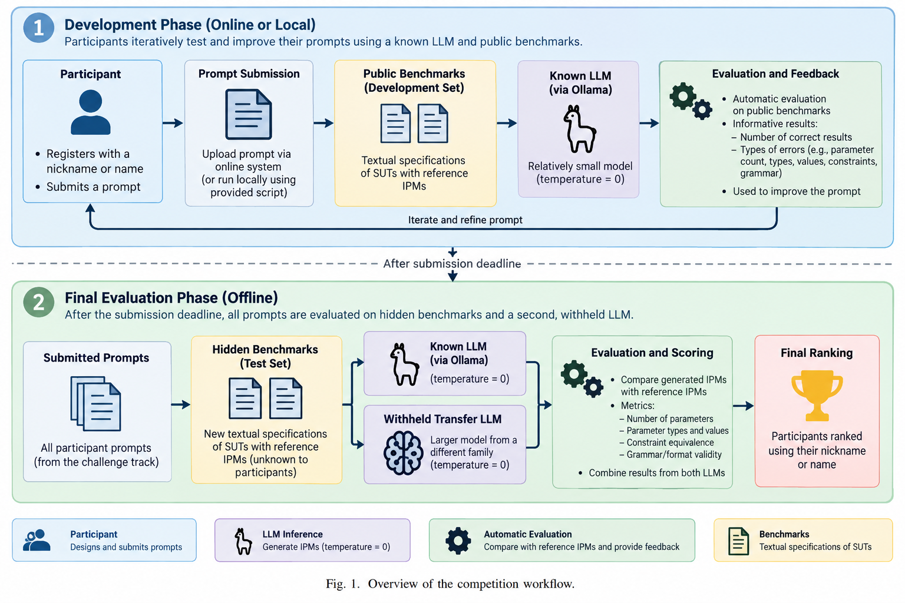

# Prompt Engineering for IPM Derivation Competition

This repository contains the public materials for the **Prompt Engineering for IPM Derivation Competition**, a proposed challenge for the ICST 2027 Challenge Competition Track.

The goal of the competition is to evaluate how well prompts can guide Large Language Models (LLMs) in deriving **Input Parameter Models (IPMs)** from textual specifications of **Systems Under Test (SUTs)**:
- Participants submit their prompts 
- The competition infrastructure runs those prompts on benchmark specifications and evaluates the generated IPMs against reference models



---

## Motivation

Combinatorial Testing (CT) relies on the construction of Input Parameter Models. An IPM describes the parameters of a system, their possible values, and the constraints that restrict valid combinations. Building such models is often manual and can be difficult for newcomers to CT.

This competition uses LLM-assisted IPM derivation as a low-barrier entry point into CT. Instead of implementing a new covering-array generator, participants work on the prompt-engineering problem of helping an LLM extract a useful IPM from a textual SUT description. This connects CT with the active area of LLM-assisted software testing and produces reusable artifacts for future research.

The competition also aims to answer the following research questions:

1. **RQ1:** To what extent can prompt-engineered LLMs derive syntactically valid and semantically accurate IPMs from textual SUT specifications?
2. **RQ2:** Which parts of IPM derivation are most challenging for LLMs: parameter identification, value extraction, or constraint derivation?
3. **RQ3:** Do prompts optimized on a known LLM generalize to unseen SUT specifications and to different LLMs?

---

## Important dates

The following dates are tentative and will be confirmed on the official ICST page, if the competition is accepted.

| Activity | Date |
| --- | --- |
| Competition website and repository available | 31 October 2026 |
| Competition opens | 1 December 2026 |
| Participant submission deadline | 15 January 2027 |
| Notification of offline evaluation results | 15 February 2027 |
| Competition report submission | 28 February 2027 |

---

## Who can participate

The competition is open to researchers, students, practitioners, and teams interested in software testing, combinatorial testing, prompt engineering, and LLM-assisted testing.

Participants do **not** need to be experts in combinatorial testing. The development benchmarks, reference IPMs, scripts, and examples are intended to make the task accessible while still enabling rigorous comparison of submitted approaches.

---

## Competition task

Given a textual specification of a SUT, participants must design a prompt that instructs an LLM to generate a corresponding IPM in the **ACTS format**.

A generated IPM should correctly identify:

- the system parameters;
- the type of each parameter;
- the possible values of each parameter;
- the constraints among parameters and values.

### Example input specification

```text
A browser configuration system supports three operating systems: Windows, Linux, and macOS.
The browser can be Edge, Firefox, or Safari. Safari is not available on Windows or Linux.
```

### Example expected ACTS-style output

```text
[System]
Name: BrowserConfiguration

[Parameter]
OS (enum): Windows, Linux, macOS
Browser (enum): Edge, Firefox, Safari

[Constraint]
OS = "Windows" => Browser != "Safari"
OS = "Linux" => Browser != "Safari"
```

The example above is illustrative. Competition benchmarks may contain different domains, parameter types, and constraints.

---

## What participants submit

Participants will submit:

1. a **nickname** (or team name), used for the public ranking, which will be posted on this repository;
2. a **prompt template** containing the literal placeholder `{SPECIFICATION}`;
3. optionally, a short participant paper describing the prompt-engineering strategy, experimental evaluation, and lessons learned.

A valid prompt template must contain `{SPECIFICATION}` exactly once or more. During execution, our runner replaces this placeholder with the textual specification of each benchmark SUT.

### Minimal prompt template example

```text
You are given the textual specification of a system under test.
Generate an Input Parameter Model in ACTS format.
Return only the ACTS model. Do not include Markdown fences or explanations.

Specification:
{SPECIFICATION}
```

---

## Repository structure

The repository is organized as follows.

```text
.
├── README.md
├── assets/
│   └── Workflow.png
├── benchmarks/
│   ├── development/
│   │   ├── specifications/
│   │   │   └── ... textual SUT specifications used during the development phase
│   │   └── IPM/
│   │       └── ... reference IPMs for the development specifications
│   └── evaluation/
│       └── ... hidden final-evaluation benchmarks, released after the submission deadline
└── scripts/
    ├── acts-ipm-runner/
    │   └── ... scripts for calling an LLM and generating IPMs
    ├── acts-ipm-equivalence-checker/
    │   └── ... scripts for checking semantic equivalence of ACTS constraints
    └── competition-runner/
        └── ... scripts for running the complete benchmark evaluation and computing scores
```

In the following, we report a brief description of the main folders and scripts.

### `benchmarks/development/`

Contains the public development-phase benchmark systems.

- `specifications/`: textual SUT descriptions given as input to the LLM.
- `IPM/`: reference IPMs corresponding to the development specifications.

Participants may use these files to understand the task, test prompts, and improve their solutions before the submission deadline.

### `benchmarks/evaluation/`

Contains the final-evaluation benchmark systems. These files are intentionally hidden during the competition and will be uploaded after the participant submission deadline.

The hidden evaluation benchmarks are used to assess whether submitted prompts generalize to unseen SUT specifications instead of overfitting to the public development examples.

### `scripts/acts-ipm-runner/`

Contains the script used to connect to an LLM and generate an IPM from a textual specification and a participant prompt.

The runner supports Ollama-compatible execution and is intended to make development reproducible on local machines or through Ollama Cloud.

### `scripts/acts-ipm-equivalence-checker/`

Contains the script used to compare the valid configuration spaces induced by two ACTS IPMs. It is used to support semantic constraint evaluation.

The checker does not simply compare the number or textual form of constraints. Instead, it uses an SMT-based approach to determine whether two IPMs admit the same valid configurations.

### `scripts/competition-runner/`

Contains the complete benchmark runner. Given specification and reference-IPM folders, a participant prompt, and one or more Ollama models, it generates every IPM, evaluates the proposal's parameter, value, and constraint components, computes the final score, and reports detailed errors. See the [competition runner documentation](scripts/competition-runner/README.md).

---

## Development-phase workflow

During the development phase, participants can iteratively improve their prompts using public benchmarks and a known LLM.

1. Choose a nickname or team name.
2. Write a prompt template containing `{SPECIFICATION}`.
3. Run the prompt on the development specifications.
4. Inspect the generated ACTS IPMs.
5. Compare generated IPMs with the reference IPMs, by using the scripts we provide in the `script` folder. 
6. Use the feedback to improve the prompt.
7. Submit the final prompt before the deadline.

The known LLM will be disclosed to participants. It will be selected to be small enough to run, when possible, on consumer-grade laptops. All LLM executions will use temperature `0` to reduce randomness and improve reproducibility.

---

## Final offline evaluation

After the participant submission deadline, the organizers will run the final offline evaluation.

Each submitted prompt will be evaluated on:

1. **hidden evaluation benchmarks**, not available during the development phase;
2. the **known LLM** used during development;
3. a **withheld transfer LLM**, larger and from a different model family, not disclosed before the final evaluation.

This design rewards both:

- accuracy on the IPM derivation task;
- robustness across unseen specifications and LLMs.

The final ranking will be computed by the organizers using the same execution environment, benchmark set, model versions, and generation parameters for all submissions.

---

## Evaluation criteria

Generated IPMs are evaluated against reference IPMs. The scoring procedure considers the main elements of an IPM.

### 1. Syntax and format validity

The generated model should follow the expected ACTS format and contain the required sections, especially `[System]`, `[Parameter]`, and, when needed, `[Constraint]`.

Outputs that are not parseable as ACTS models may receive no score for the affected benchmark.

### 2. Parameter correctness

The evaluation considers whether the generated IPM contains the correct parameters.

Parameter-related checks include:

- number of parameters;
- parameter names;
- parameter types;
- missing parameters;
- spurious parameters.

Parameter count will be scored using normalized distance from the reference model. 
Parameter names will be evaluated using exact matching and, where appropriate, semantic similarity.

### 3. Value correctness

The evaluation considers whether each parameter has the correct set of values.

Value-related checks include:

- number of values;
- value names;
- missing values;
- spurious values.

### 4. Constraint correctness

Constraint evaluation focuses on semantic equivalence rather than textual equality.

A generated IPM will receive credit for constraints even if they are written differently from the reference constraints, provided that they define the same set of valid configurations. 
Conversely, a syntactically valid constraint set will be penalized if it admits configurations that should be forbidden or forbids configurations that should be allowed.

The `acts-ipm-equivalence-checker` supports this evaluation by comparing the solution spaces of generated and reference IPMs using an SMT solver.

### 5. Aggregate score and ranking

The final score will combine parameter, value, and constraint scores. Parameter errors are expected to receive the highest weight, followed by value errors and constraint errors, as incorrect parameters affect the interpretation of the entire IPM.

For participant `i`, the final score is computed from the results obtained on the hidden evaluation benchmarks with both the known LLM and the withheld transfer LLM:

```text
final_score_i = score_i_known_llm + score_i_transfer_llm
```

The precise scoring weights and thresholds will be documented before the competition opens.

---

## Quick start: run a prompt locally

The commands below illustrate the local development workflow. Exact model names and final scripts may be updated before the competition opens.

### 1. Clone the repository

```bash
git clone https://github.com/foselab/PromptEngineeringCompetition4CT.git
cd PromptEngineeringCompetition4CT
```

### 2. Install and start Ollama

Install Ollama following the official Ollama instructions for your operating system. Then pull the known development model announced by the organizers.

```bash
ollama pull <known-model-name>
ollama serve
```

Replace `<known-model-name>` with the model selected for the competition.

### 3. Create a prompt template

Create a file named `prompt.txt` with the `{SPEFICICATION}` placeholder where you expect the textual SUT specification to be substituted.

### 4. Generate an IPM for one specification

```bash
python3 scripts/acts-ipm-runner/generate_ipm.py \
  --provider local \
  --model <known-model-name> \
  --prompt-file prompt.txt \
  --specification-file benchmarks/development/specifications/<specification-file>.txt \
  --output-dir results \
  --overwrite
```

The generated IPM will be saved in the `results/` directory as an `.acts` file.

### 5. Check semantic equivalence of constraints

Install the requirements for the equivalence checker.

```bash
cd scripts/acts-ipm-equivalence-checker
python3 -m venv .venv
. .venv/bin/activate
python3 -m pip install -r requirements.txt
```

Then compare a generated IPM with a reference IPM.

```bash
python3 acts_equiv.py \
  ../../benchmarks/development/IPM/<reference-file>.acts \
  ../../results/<generated-file>.acts
```

### 6. Run the complete development evaluation

The complete competition runner will evaluate a submitted prompt against a benchmark set and compute the development score.

Once available, the workflow will follow this structure:

```bash
python3 scripts/competition-runner/run_competition.py \
  --benchmark-dir benchmarks/development \
  --prompt-file prompt.txt \
  --model <known-model-name> \
  --output-dir results/development-run
```

If the online submission system is available, participants may use the web interface instead of running the complete local workflow.


---

## Contacts

For questions about the competition, please contact the organizing committee:

- **Andrea Bombarda**, University of Bergamo — <andrea.bombarda@unibg.it>
- **Jaganmohan Chandrasekaran**, Kennesaw State University — <jchandr2@kennesaw.edu>
- **Erin Lanus**, Virginia Tech — <lanus@vt.edu>

If your question is about the repository, or you believe that others may benefit from solving the same doubt, please open an issue on GitHub.
